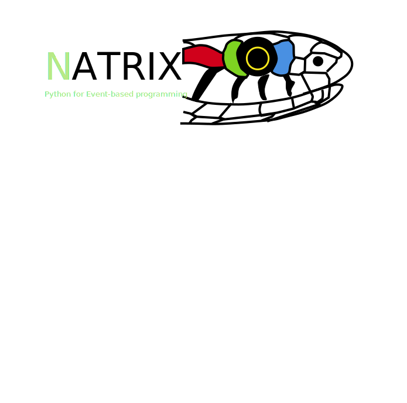

# natrix
python3 library to handle EventStream file format

 !Warning: writing a generic stream is not implemented yet

Dependencies:
 - numpy

To read an es file, use

~~~
import natrix;
stream = natrix.readsteam("filename");
~~~

The function return a class containing a recordarray of the data

The array can be access using stream.data
Each field can be accessed using its name as stream.data.<fieldname> which return an array
Similarly this method can be used on each record of stream.data

For instances with the timestamp (ts):
~~~
for datum in stream data:
    print (data.ts);
~~~
